# NovaTech Hub

A production-grade, community-driven gadget review & rating platform. Think "write honest reviews, earn the trust of the crowd" — ratings are **computed live from the database**, never faked, never cached.

> **🔗 Live:** [novatech-hub.vercel.app](https://novatech-hub.vercel.app)  
> **📦 Code:** [github.com/katyasurina/Novatech-hub](https://github.com/katyasurina/Novatech-hub)

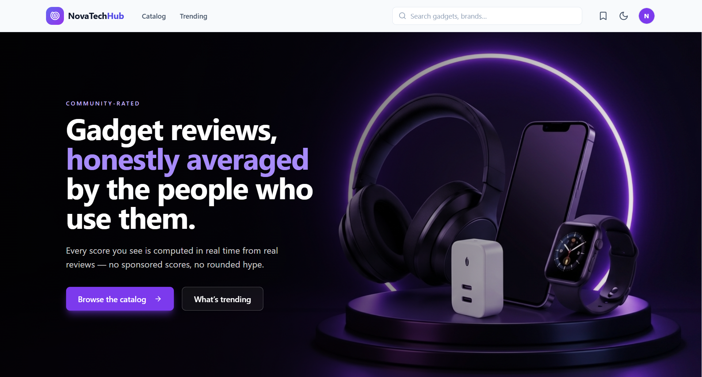

---

## Demo

### Catalog with filters, search, and pagination
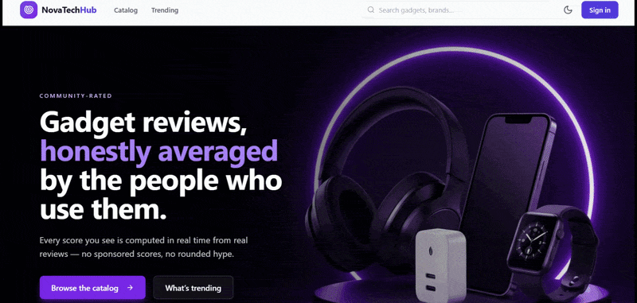

### Product page with live ratings and reviews
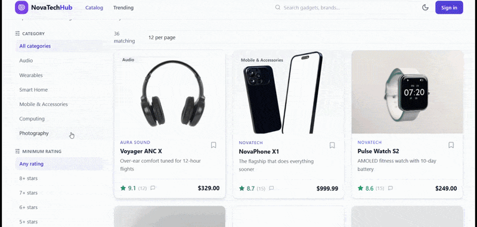

### Admin panel with stats and moderation
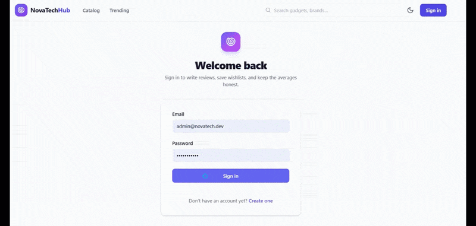

---

## Features

- **Community reviews, computed live** — every average, histogram, and "trending" score is a Postgres aggregate over *visible* reviews at request time. Nothing is cached.
- **Honest-by-construction ratings** — one review per user per product, a 1–10 rating scale, and admin moderation that *suspends* (never deletes) offending reviews.
- **Trending with a visible formula** — each product ships a score *and* a readable breakdown (`0.55·rating + 0.30·volume + 0.15·recency`), so the UI can show *why* something is trending.
- **Real-time review delivery** — Socket.IO pushes `review:created` events so a new review lands on every open product page instantly.
- **Deferred trust auth** — HttpOnly refresh cookie with **rotation**: every refresh bumps a `refreshTokenVersion`, so an old cookie dies the moment a newer one is issued.
- **Fully shareable catalog** — search, category, min-rating, min/max price, sort, and pagination all live in the URL query string.
- **Admin studio** — product CRUD + a review moderation queue (suspend/restore/hard-delete), Recharts dashboard, all behind a role guard.
- **Wishlists, profiles & avatars** — per-user saves, public profile pages with stats, avatar uploads.
- **Deployed and live** — frontend on Vercel (CDN), API on Railway, database on Neon (serverless Postgres).

---

## Architecture

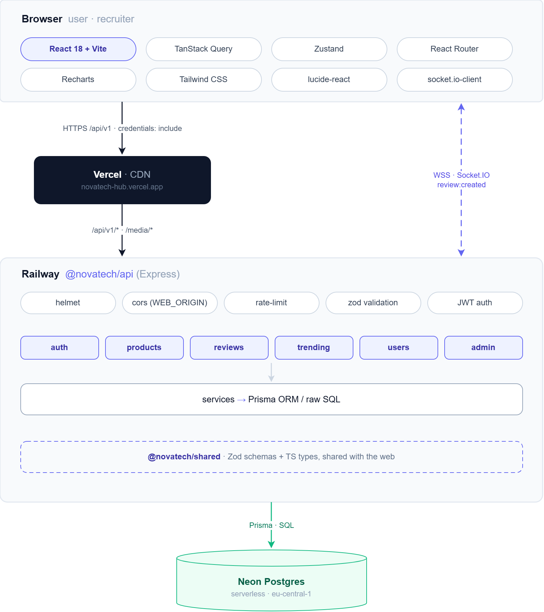

### Monorepo layout

| Path                | Role |
| ------------------- | ---- |
| `packages/shared`   | **The contract.** Zod schemas + inferred TS types shared by both apps. Consumed raw (no build step). |
| `apps/api`          | Express API. Auth, catalog, reviews, trending, users, admin. Prisma + PostgreSQL, Socket.IO, realtime. |
| `apps/web`          | React SPA. URL-driven catalog, live product pages, profile editor, wishlist, admin dashboard. |

### The shared contract (why nothing drifts)

`@novatech/shared` is a TypeScript *source* package. Both apps import it directly, so the Zod schemas (server-side validation) and the TS types (client-side) are literally the same code — a field renamed on the API is a compile error in the web app, not a silent 500.

---

## Tech stack

**Frontend** — React 18 · TypeScript · Vite 5 · TanStack Query v5 · Zustand · React Router 6 · Tailwind CSS 3 · Recharts

**Backend** — Node 20 · TypeScript 5 · Express 4 · Prisma 5 · PostgreSQL 16 · Zod · Socket.IO · JWT (access + refresh) · bcryptjs · multer · helmet

**Infrastructure** — Docker (local Postgres) · Neon (production Postgres) · Railway (API) · Vercel (frontend) · GitHub (CI on push)

---

## Screenshots

### Home
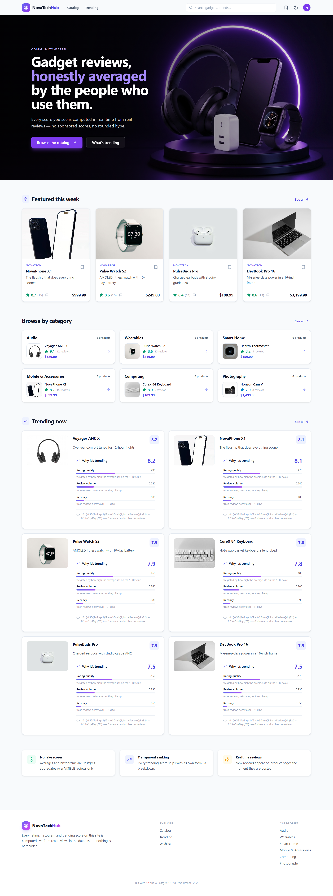

### Catalog
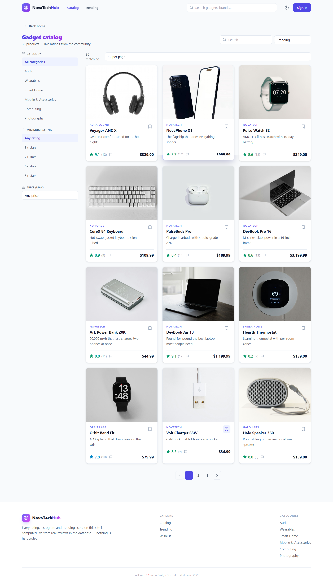

### Product page
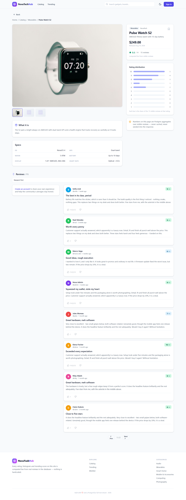

### Trending with score breakdown
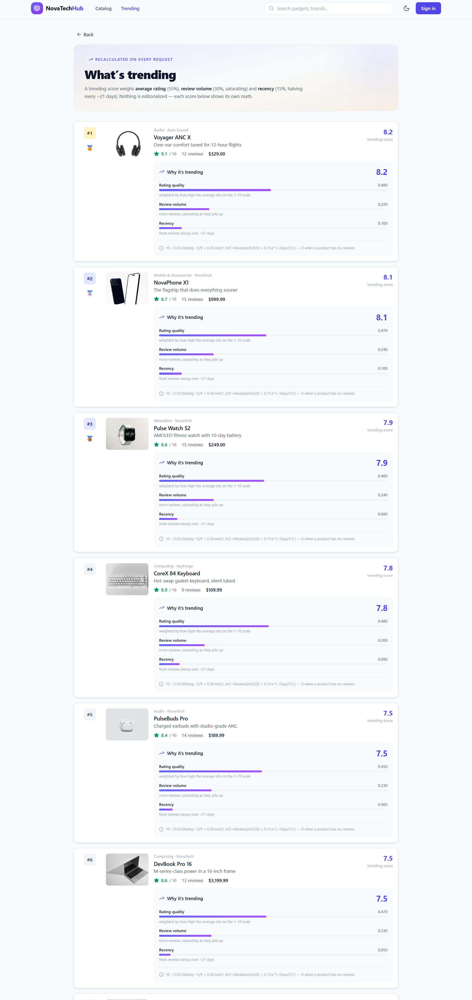

### Admin panel
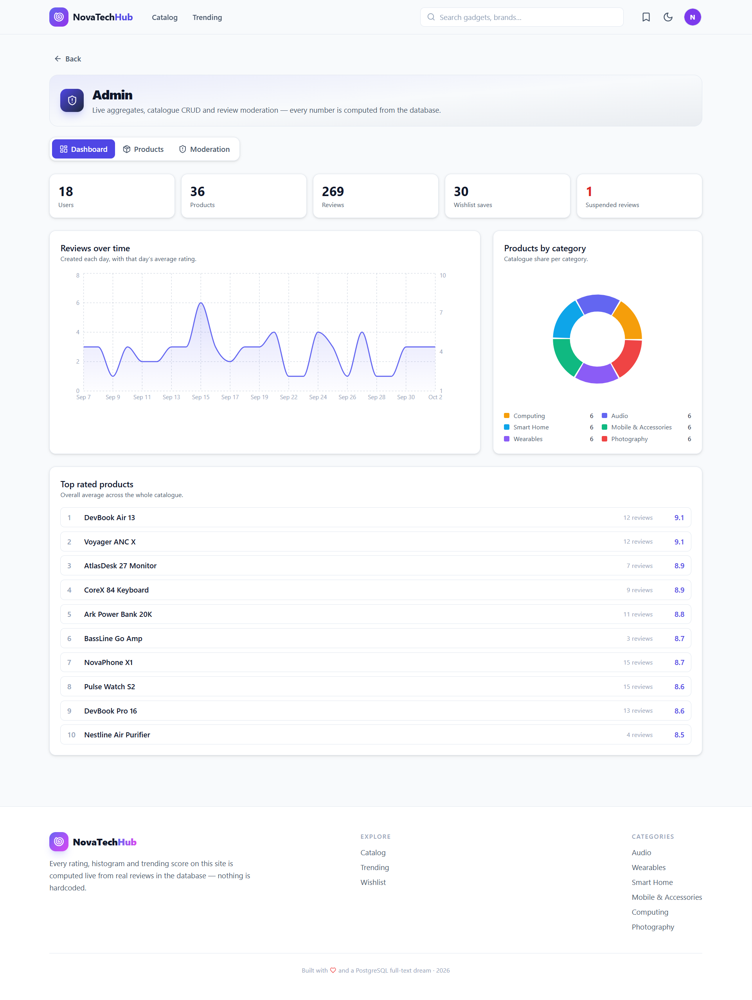

### Dark mode
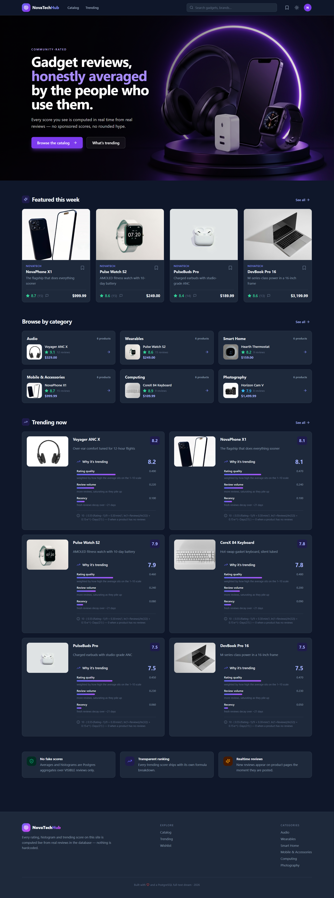

---

## Deployment

Production runs on a three-service architecture:

| Layer       | Service                          | URL                                              |
| ----------- | -------------------------------- | ------------------------------------------------ |
| Frontend    | [Vercel](https://vercel.com)     | `https://novatech-hub.vercel.app`                |
| API         | [Railway](https://railway.app)   | `https://novatechapi-production.up.railway.app`  |
| Database    | [Neon](https://neon.tech)        | serverless Postgres, Frankfurt (eu-central-1)    |

Every push to `main` triggers automatic redeploys on both Vercel and Railway.

---

## Getting started (local)

### Prerequisites

- **Node.js ≥ 20** and **npm**
- **Docker Desktop** (for local Postgres) — [download](https://www.docker.com/products/docker-desktop)

### 1. Install

```bash
npm install
```

### 2. Start Postgres

```bash
docker compose up -d
```

Boots a PostgreSQL 16 container on port `5433`, backed by a persistent Docker volume.

### 3. Migrate & seed

```bash
npm run db:setup
```

Creates the database, runs Prisma migrations, and seeds 6 primary users (1 admin + 5 demo), 36 products across 6 categories, and ~270 reviews plus votes and wishlist rows.

### 4. Run it

```bash
npm run dev          # API (:4000) + web (:5173)
```

Open **http://localhost:5173**.

### 5. Stop

Press **Ctrl+C** in the `npm run dev` terminal.

To stop Postgres:

```bash
docker compose down
```

If Postgres ever gets stuck:

```bash
npm run db:kill     # force-kill orphaned postgres processes
```

---

## Demo accounts

All seeded users share the password **`novatech123`**:

| Role   | Email                |
| ------ | -------------------- |
| Admin  | `admin@novatech.dev` |
| User   | `priya@example.com`  |
| User   | `marco@example.com`  |
| User   | `elena@example.com`  |
| User   | `tom@example.com`    |
| User   | `riley@example.com`  |

---

## API reference

All endpoints are namespaced under `/api/v1`.

| Method   | Path                                          | Auth     | Description |
| -------- | --------------------------------------------- | -------- | ----------- |
| `GET`    | `/api/v1/health`                              | —        | Liveness probe |
| `POST`   | `/api/v1/auth/register`                       | —        | Create account |
| `POST`   | `/api/v1/auth/login`                          | —        | Sign in (rate-limited) |
| `POST`   | `/api/v1/auth/refresh`                        | cookie   | Rotate refresh cookie |
| `POST`   | `/api/v1/auth/logout`                         | cookie   | Revoke refresh tokens |
| `GET`    | `/api/v1/auth/me`                             | ✓        | Current user |
| `GET`    | `/api/v1/products`                            | opt ✓    | Catalog with filters |
| `GET`    | `/api/v1/products/:slug`                      | opt ✓    | Product + rating summary |
| `GET`    | `/api/v1/products/:productId/reviews`         | opt ✓    | Paginated reviews |
| `POST`   | `/api/v1/products/:productId/reviews`         | ✓        | Create review |
| `PATCH`  | `/api/v1/products/:productId/reviews/:reviewId` | ✓      | Edit own review |
| `DELETE` | `/api/v1/products/:productId/reviews/:reviewId` | ✓      | Delete own review |
| `POST`   | `/api/v1/reviews/:reviewId/vote`              | ✓        | Upvote / downvote |
| `GET`    | `/api/v1/trending?limit`                      | —        | Trending with breakdown |
| `GET`    | `/api/v1/home`                                | —        | Homepage aggregates |
| `GET`    | `/api/v1/users/:username`                     | opt ✓    | Public profile |
| `GET`    | `/api/v1/users/me`                            | ✓        | Own profile |
| `PATCH`  | `/api/v1/users/me`                            | ✓        | Update profile |
| `POST`   | `/api/v1/users/me/avatar`                     | ✓        | Upload avatar |
| `GET`    | `/api/v1/users/me/wishlist`                   | ✓        | Wishlist |
| `PUT`    | `/api/v1/users/me/wishlist/:productId`        | ✓        | Add to wishlist |
| `DELETE` | `/api/v1/users/me/wishlist/:productId`        | ✓        | Remove from wishlist |
| `GET`    | `/api/v1/admin/stats`                         | admin    | Dashboard aggregates |
| `GET`    | `/api/v1/admin/products`                      | admin    | Product management |
| `POST`   | `/api/v1/admin/products`                      | admin    | Create product |
| `PUT`    | `/api/v1/admin/products/:id`                  | admin    | Update product |
| `DELETE` | `/api/v1/admin/products/:id`                  | admin    | Delete product |
| `GET`    | `/api/v1/admin/reviews?status`                | admin    | Moderation queue |
| `PUT`    | `/api/v1/admin/reviews/:id/status`            | admin    | Suspend / restore review |
| `DELETE` | `/api/v1/admin/reviews/:id`                   | admin    | Hard-delete review |

---

## How trending works

```
score = 10 · ( 0.55·(Rating−1)/9
              + 0.30·min(1, ln(1+Reviews)/ln(32))
              + 0.15·e^(−DaysSinceLastReview/21) )
```

| Term    | Weight | Shape | Why |
| ------- | ------ | ----- | --- |
| Rating  | 0.55   | Linear, 1–10 → 0–1 | Quality dominates, but a single 10/10 can't corner the chart |
| Volume  | 0.30   | Saturating log, clamped at 1.0 | "Many recent reviews" beat "one ancient rave" without snowballing |
| Recency | 0.15   | Exponential decay, half-life ≈ 21 days | An old hit slides down unless the community keeps engaging |

Every term is computed from live DB rows at request time. The formula lives in **one file** (`score.ts`) and ships both the SQL and a JS mirror (used by tests). Each trending row exposes its `scoreBreakdown` so the UI can show *why* a product ranks where it does.

---

## Architecture decisions

1. **The DB is the single source of truth for every number.** Averages, histograms, counts, and trending scores are Postgres aggregates computed at request time. No cached "average" column anywhere.
2. **Money is `priceMinor: Int`, never a float.** Integer minor units (cents) eliminate floating-point rounding surprises.
3. **The shared Zod contract is the boundary.** Renaming a field on the API is a compile error in the web app.
4. **`noUncheckedIndexedAccess` is on, everywhere.** "Possibly undefined" failures are part of the type system, not a runtime surprise.
5. **Refresh-token rotation via a version counter.** An old refresh cookie is invalid the instant a newer one is issued.
6. **Suspension over deletion for moderation.** Hidden reviews stay in the DB for audits but join the `VISIBLE` filter on every aggregation.
7. **Realtime as an enhancement, not a dependency.** Socket.IO pushes events; if a client misses one, refetch still works.

---

## Project scripts

| Script                    | What |
| ------------------------- | ---- |
| `dev`                     | API (:4000) + web (:5173) with reload |
| `typecheck`               | `tsc --noEmit` across all packages |
| `test`                    | Vitest — trending formula tests |
| `build`                   | Bundle API (tsup) + web (tsc + vite build) |
| `db:setup`                | Migrate + seed on the running Postgres |
| `db:kill`                 | Force-kill orphaned Postgres processes |
| `db:migrate:prod`         | `prisma migrate deploy` (production) |

---

*Rated by the community, computed by Postgres, shipped in a monorepo where the API and its client can't drift apart.*
